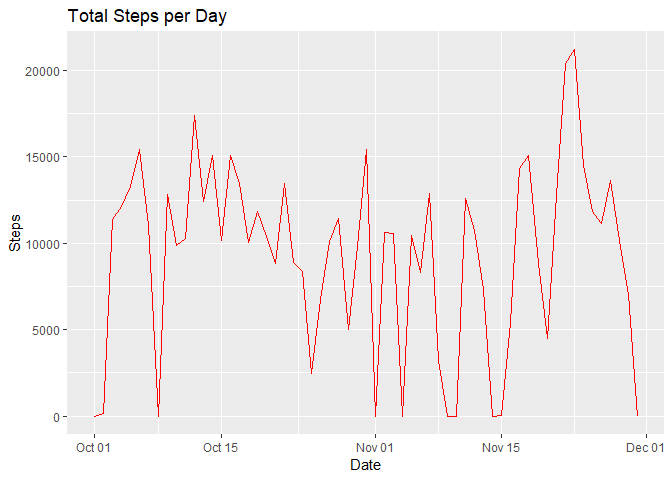
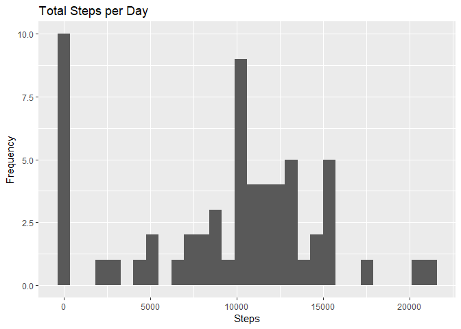
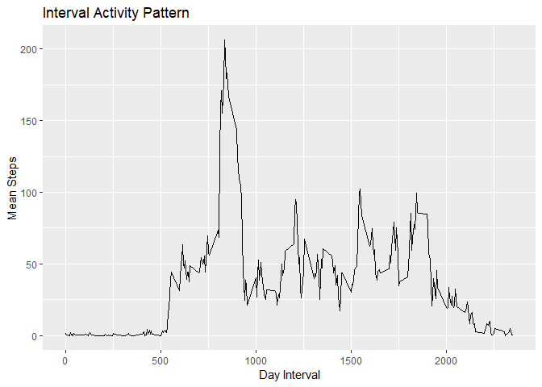
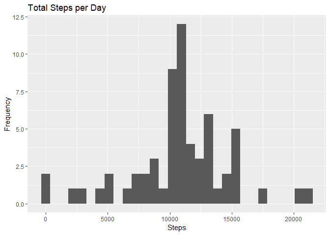
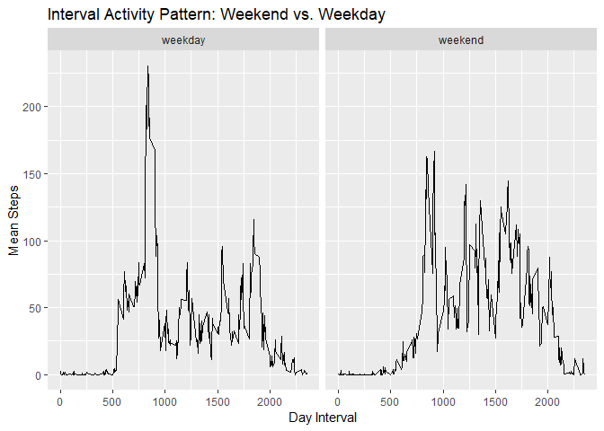

  
# Loading and preprocessing the data


```r
library(tidyverse)
```

```
## -- Attaching packages -------------------------------------------- tidyverse 1.2.1 --
```

```
## v ggplot2 3.0.0     v purrr   0.2.5
## v tibble  1.4.2     v dplyr   0.7.6
## v tidyr   0.8.1     v stringr 1.3.1
## v readr   1.1.1     v forcats 0.3.0
```

```
## -- Conflicts ----------------------------------------------- tidyverse_conflicts() --
## x dplyr::filter() masks stats::filter()
## x dplyr::lag()    masks stats::lag()
```

```r
data <- read_csv("activity.zip")
```

```
## Parsed with column specification:
## cols(
##   steps = col_integer(),
##   date = col_date(format = ""),
##   interval = col_integer()
## )
```


#What is mean total number of steps taken per day?

##1. Calculate the total number of steps taken per day


```r
totalsteps <- data %>% 
  group_by(date) %>% 
  summarise(total_steps = sum(steps, na.rm=TRUE))

head(totalsteps, 10)
```

```
## # A tibble: 10 x 2
##    date       total_steps
##    <date>           <int>
##  1 2012-10-01           0
##  2 2012-10-02         126
##  3 2012-10-03       11352
##  4 2012-10-04       12116
##  5 2012-10-05       13294
##  6 2012-10-06       15420
##  7 2012-10-07       11015
##  8 2012-10-08           0
##  9 2012-10-09       12811
## 10 2012-10-10        9900
```

```r
#line plot with total number of steps per day

ggplot(totalsteps, aes(date, total_steps)) +
  geom_line(color = "red") +
  labs(title = "Total Steps per Day", x = "Date", y = "Steps")
```

<!-- -->


##2. If you do not understand the difference between a histogram and a barplot, research the difference between them. Make a histogram of the total number of steps taken each day


```r
ggplot(totalsteps, aes(total_steps)) +
  geom_histogram() +
  labs(title = "Total Steps per Day", x = "Steps", y = "Frequency")
```

```
## `stat_bin()` using `bins = 30`. Pick better value with `binwidth`.
```

<!-- -->


##3. Calculate and report the mean and the median of the total number of steps taken per day


```r
totalsteps %>% summarise(mean_total_step = mean(total_steps, na.rm=TRUE))
```

```
## # A tibble: 1 x 1
##   mean_total_step
##             <dbl>
## 1           9354.
```

```r
totalsteps %>% summarise(median_total_step = median(total_steps, na.rm=TRUE))
```

```
## # A tibble: 1 x 1
##   median_total_step
##               <int>
## 1             10395
```

mean total number of steps per day = 9,354.23
median total number of steps per day = 10,395


#What is the average daily activity pattern?

##1. Make a time series plot of the 5-minute interval (x-axis) and the average number of steps taken, averaged across all days (y-axis)


```r
pattern <- data %>% group_by(interval) %>% summarise(mean_interval = mean(steps, na.rm = TRUE))

ggplot(pattern, aes(interval, mean_interval)) +
  geom_line() +
  labs(title = "Interval Activity Pattern", x = "Day Interval", y = "Mean Steps")
```

<!-- -->


##2. Which 5-minute interval, on average across all the days in the dataset, contains the maximum number of steps?


```r
pattern[which.max(pattern$mean_interval),]
```

```
## # A tibble: 1 x 2
##   interval mean_interval
##      <int>         <dbl>
## 1      835          206.
```

On average accross all days the interval 835 contains the maximum number of steps.

#Imputing missing values

Note that there are a number of days/intervals where there are missing values (Coded as NA). The presence of missing days may introduce bias into some calculations or summaries of the data.

##1. Calculate and report the total number of missing values in the dataset (i.e. the total number of rows with NAs)


```r
sum(is.na(data$steps))
```

```
## [1] 2304
```

There are a total of 2,304 NAs in the data.

##2. Devise a strategy for filling in all of the missing values in the dataset. The strategy does not need to be sophisticated. For example, you could use the mean/median for that day, or the mean for that 5-minute interval, etc.

##3. Create a new dataset that is equal to the original dataset but with the missing data filled in.


```r
data_fill <- data
na_vector <- is.na(data_fill$steps)
interval_average <- tapply(data$steps, data$interval, mean, na.rm=TRUE, simplify=T)
data_fill$steps[na_vector] <- interval_average[as.character(data_fill$interval[na_vector])]
```

##4. Make a histogram of the total number of steps taken each day and Calculate and report the mean and median total number of steps taken per day. Do these values differ from the estimates from the first part of the assignment? What is the impact of imputing missing data on the estimates of the total daily number of steps?


```r
total_steps_fill <- data_fill %>% 
  group_by(date) %>% 
  summarise(total_steps_fill = sum(steps, na.rm=TRUE))

ggplot(total_steps_fill, aes(total_steps_fill)) +
  geom_histogram() +
  labs(title = "Total Steps per Day", x = "Steps", y = "Frequency")
```

```
## `stat_bin()` using `bins = 30`. Pick better value with `binwidth`.
```

<!-- -->

```r
total_steps_fill %>% summarise(mean_total_step_fill = mean(total_steps_fill, na.rm=TRUE))
```

```
## # A tibble: 1 x 1
##   mean_total_step_fill
##                  <dbl>
## 1               10766.
```

```r
total_steps_fill %>% summarise(median_total_step_fill = median(total_steps_fill, na.rm=TRUE))
```

```
## # A tibble: 1 x 1
##   median_total_step_fill
##                    <dbl>
## 1                 10766.
```

Given that the strategy implemented to fill the missing data is to use the interval average, now the mean and median are equal.


#Are there differences in activity patterns between weekdays and weekends?

For this part the weekdays() function may be of some help here. Use the dataset with the filled-in missing values for this part.

##1. Create a new factor variable in the dataset with two levels – “weekday” and “weekend” indicating whether a given date is a weekday or weekend day.


```r
#support function to assign days to "weekday" or "weekend"

myweekday2 <- function(x) {
  ifelse (x == "Saturday" | x == "Sunday", 
          "weekend", 
          "weekday")
}

data_fill <- data_fill %>% mutate(dayweek = as.factor(weekdays(date)))
data_fill <- data_fill %>% mutate(week_day_end = as.factor(myweekday2(dayweek)))

unique(data_fill$week_day_end)
```

```
## [1] weekday weekend
## Levels: weekday weekend
```

##2. Make a panel plot containing a time series plot (i.e. type="l") of the 5-minute interval (x-axis) and the average number of steps taken, averaged across all weekday days or weekend days (y-axis). See the README file in the GitHub repository to see an example of what this plot should look like using simulated data.


```r
pattern_week <- data_fill %>% group_by(interval, week_day_end) %>%  mutate(mean_step_interval = mean(steps))

ggplot(pattern_week, aes(interval, mean_step_interval)) +
  geom_line() +
  facet_wrap(~ week_day_end) +
  labs(title = "Interval Activity Pattern: Weekend vs. Weekday", x = "Day Interval", y = "Mean Steps")
```

<!-- -->

